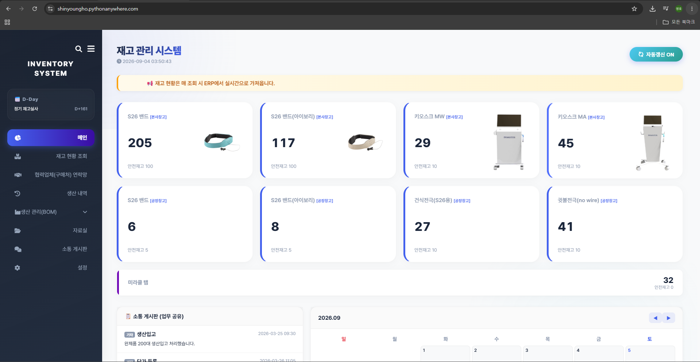
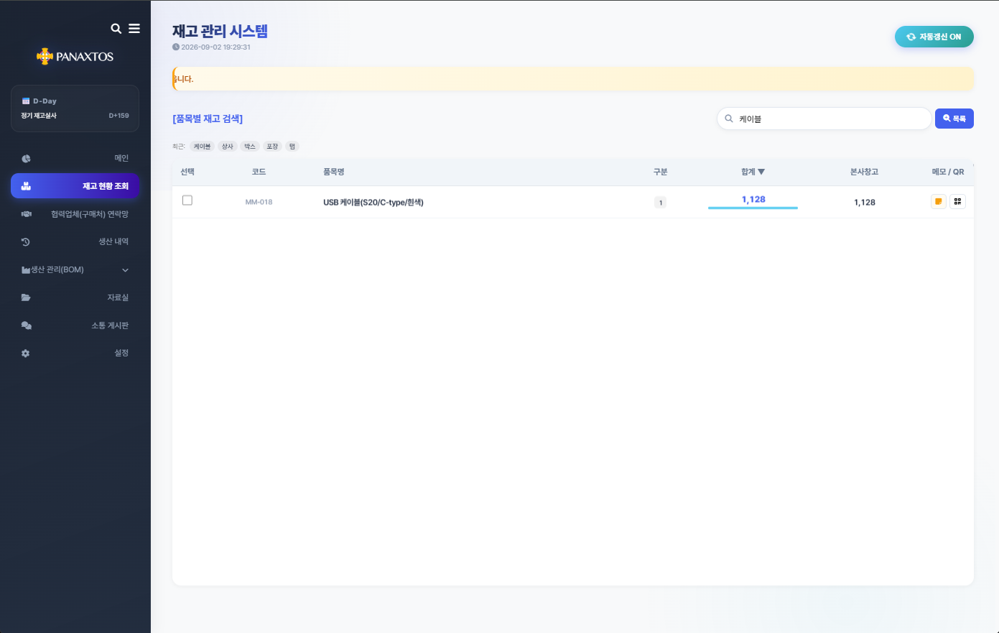
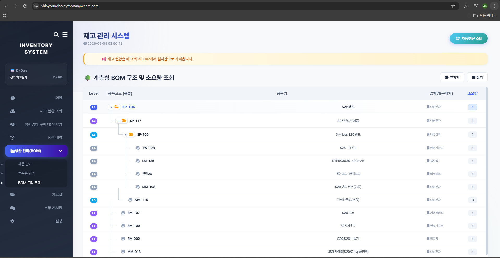
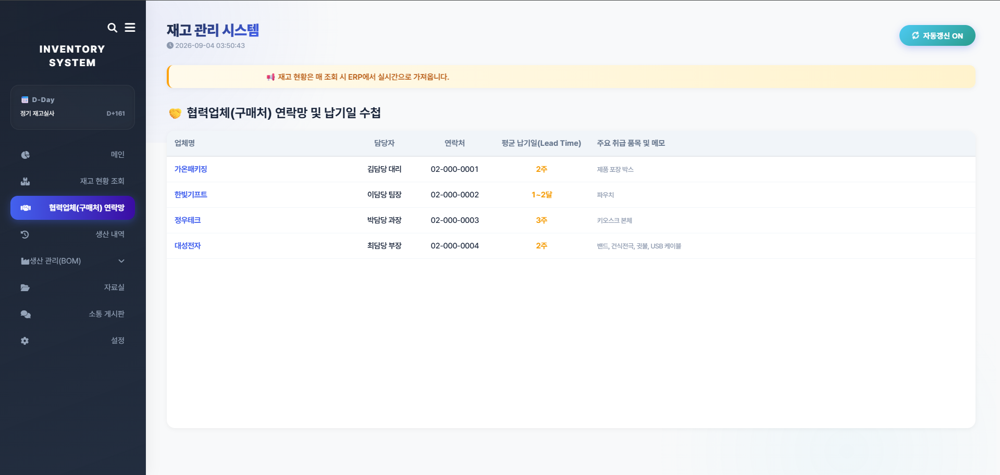

# 사내 재고 현황 대시보드
**데모** https://shinyoungho.pythonanywhere.com (ID: admin / PW: 1234)

의료기기 제조사 재직 중, 재고 조회와 생산·구매 관련 기록을 한 화면에서 처리하기 위해
직접 만들어 운영한 사내 웹 대시보드입니다. 기획부터 개발, 배포, 운영까지 혼자 진행했습니다.

## 왜 만들었나

재고를 확인할 일이 하루에 7~10건 있었는데, 방법이 두 가지였고 둘 다 불편했습니다.

담당자에게 전화로 물어보면 건당 1~2분이 걸렸고, 무엇보다 문의를 받는 쪽의 일이 그때마다 끊겼습니다. 직접 확인하려면 ERP에 로그인해 메뉴를 여러 단계 타고 들어가 품목을 검색해야 했습니다. 자주 보는 품목은 정해져 있는데 매번 같은 과정을 반복하는 것이 비효율적이라고 느꼈습니다.

데이터는 ERP에 이미 있는데 접근할 방법이 마땅치 않은 것이 문제였습니다.

또 BOM 구조, 부속품 단가, 협력업체 연락처, 입고 이력도 엑셀 파일과 메신저, 구두 전달로 흩어져 있어 필요할 때 찾기 어려웠습니다.

그래서 ERP의 OpenAPI로 재고를 직접 가져와 자주 보는 품목을 한 화면에 띄우고, 흩어져 있던 정보를 한곳에 모으는 대시보드를 만들었습니다.

## 결과

- 재고 확인 시간이 건당 1~2분에서 약 30초로 줄었습니다
- 사내 7명이 사용했습니다
- 퇴사 후 6개월이 지난 현재까지 별도 유지보수 없이 계속 운영되고 있습니다

## 주요 기능

**재고 현황**
- 이카운트 ERP OpenAPI 연동으로 실시간 재고 조회
- 자주 보는 품목을 KPI 카드로 고정, 안전재고 미달 시 강조 표시
- 창고별 조회, 품목 검색

**BOM 관리**
- 완제품에서 부속품까지 계층형 트리로 구성
- 엑셀 양식 일괄 업로드
- 생산 수량 입력 시 필요한 부속품 소요량 자동 산출

**단가 및 구매**
- 부속품 입고 단가 등록, 개당 단가 자동 계산
- 협력업체 연락망과 리드타임 관리
- 입고 이력 조회

**사내 공유**
- 게시판, 공지사항, 품목별 메모
- 캘린더, D-day
- 자료실 (파일 업로드/다운로드)
- 전체 작업 감사 로그

## 화면

### 메인 대시보드
자주 보는 품목을 KPI 카드로 고정하고, 게시판·일정을 한 화면에서 확인합니다.



### 재고 현황
ERP에서 가져온 재고를 창고별로 조회하고 안전재고 미달 품목을 강조합니다.



### BOM 및 단가 관리
완제품에서 부속품까지 계층 구조로 관리하고, 생산 수량에 따른 소요량을 계산합니다.



### 협력업체 연락망
구매처 연락처와 평균 납기일을 함께 관리합니다.



## 기술

- Python 3.12, Flask
- 프론트엔드는 별도 프레임워크 없이 HTML / CSS / Vanilla JS로 구성
- 데이터는 JSON 파일 기반으로 저장
- 이카운트 ERP OpenAPI 연동
- 사내망 외부 접속은 ngrok 터널링으로 처리

### 설계에서 고민한 것

**세션 재사용** — ERP API는 요청마다 로그인하면 응답이 느려지고 호출 제한에도 걸립니다.
발급받은 세션 ID를 서버 메모리에 보관하고 만료 시간(50분)이 지났을 때만 재발급하도록 했습니다.

**DB 없이 JSON 파일** — 사용자가 7명 규모이고 사내망에서만 접근하는 환경이라,
별도 DB 서버를 두는 것보다 JSON 파일로 관리하는 편이 배포와 백업 모두 단순했습니다.
데이터가 커지거나 동시 쓰기가 많아지면 DB로 옮겨야 하는 구조라는 점은 알고 있습니다.

**퇴사 후에도 돌아가야 함** — 만든 사람이 없어도 유지되도록 서버 실행 절차를 문서화하고,
설정값은 코드가 아닌 별도 파일에서 바꿀 수 있게 분리했습니다.

## 실행 방법

```bash
git clone <이 저장소 주소>
cd <폴더명>

python -m venv venv
venv\Scripts\activate        # Windows
source venv/bin/activate     # macOS / Linux

pip install -r requirements.txt

# 환경변수 설정
copy .env.example .env       # Windows
cp .env.example .env         # macOS / Linux
# .env 파일을 열어 실제 값을 채웁니다

python app.py
```

브라우저에서 `http://127.0.0.1:2580` 으로 접속합니다.

## 데모 모드

ERP 접속 정보 없이도 화면을 확인할 수 있도록 데모 모드를 넣었습니다.
`.env` 에 `ECOUNT_API_CERT_KEY` 가 비어 있으면 자동으로 켜지며, 실제 API를 호출하는
대신 `demo_inventory.json` 의 예시 재고를 같은 응답 형식으로 반환합니다.

강제로 켜려면 `.env` 에 다음을 추가합니다.

```
DEMO_MODE=true
```

기본 로그인 정보는 `admin` / `changeme` 이며 `.env` 의 `ADMIN_ID`, `ADMIN_PW` 로 변경합니다.

## 공개 저장소 안내

이 저장소는 포트폴리오 목적으로 공개한 버전입니다. 실제 운영 환경과 다음이 다릅니다.

- API 인증키, 계정 정보 등 자격증명은 모두 환경변수로 분리했으며 저장소에 포함되지 않습니다
- 관리자 비밀번호는 평문 대신 SHA-256 해시로 비교합니다
- 협력업체명, 담당자, 연락처, 품번, 단가 등 실제 데이터는 모두 가상의 값으로 교체했습니다
- 실제 업로드 파일과 운영 로그는 제거했습니다
- ERP 접속 정보 없이도 확인할 수 있도록 데모 모드를 추가했습니다

데이터 구조와 코드는 실제 운영하던 것과 동일합니다.
